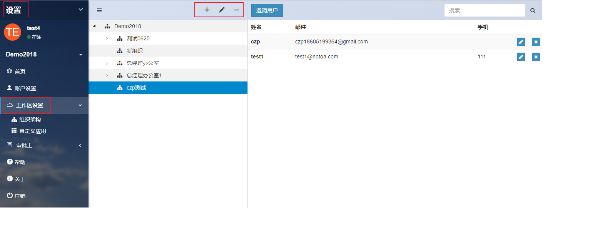
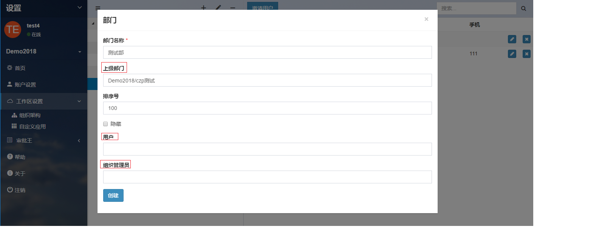

## 设置组织架构：部门

在普通用户使用审批王前，管理员需要预先做好设置工作：添加部门、添加人员账号、分配人员至各自的部门、设置岗位、设置岗位成员。

这里首先介绍设置部门。华炎审批王允许设置无限层级的部门体系。

在工作区的设置界面，选择“组织架构”，就可以设置该工作区的部门体系。

#### 新增部门

- **一级部门。**在工作区的设置界面，选择“组织架构”，点击部门列表上的“+”按钮，输入部门名称、排序号，添加用户(部门人员)和组织管理员点击“创建”即完成一级部门的新增。
   注意：新增部门页面有个“隐藏”可选按钮，选中之后，普通用户在通讯录里是看不到此部门的，管理员在组织架构里看到的此部门为灰色。

- **下级部门。**如果您要在某一部门下增加一个下级部门，则在新增部门页面，选择上级部门；也可以先选择这个部门，然后新增一个部门，默认的上级部门就是选择的这个部门。

#### 修改部门

点击部门列表右侧的“笔形状”按钮，在该页面，您可以作如下操作：

- 修改上级部门
- 修改部门名称
- 修改部门用户及管理员
- 修改部门排序号

#### 删除部门

- 若部门内有人员，则不能删除，需先编辑部门人员的“所属部门”，移除要删除的部门。若部门内人员也要删除，可直接先删除人员。
- 在部门内无人员时，可点击“-”，删除部门。
- 如果想删除的部门有下级部门，则无法删除该部门。您需要将所有的下级部门删除，然后才可以删除该部门。

#### 部门排序

- 每个部门都有一个排序号，系统为每个部门默认的排序号是100，并以本地一个特定的顺序来比较每两个部门。
- 选中某个部门，编辑，修改排序号，可以重新排序。
- 排序号大的部门排在前面。