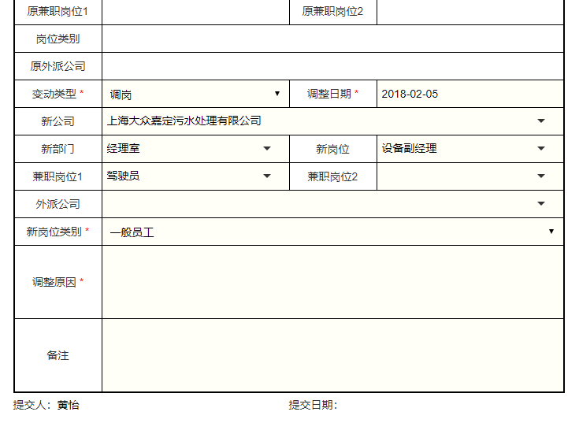

# 审批王特色功能
### 面向大中型企业、国企、政府机构

### 图形化的表单与流程设计工具
审批王提供图形化的表单与流程设计界面，可以设计条件判断，支持处理数百个节点的复杂流程，即使是数万人的大型集团企业，也能轻松设计出符合需求的业务流程。
http://oss.steedos.com/videos/cn/图形化表单与流程设计.mp4

### 流程版本控制
即使流程正在运行，您也可以随时修改流程，您对流程所做的任何修改都不会影响运行中和已结束的申请单。
http://oss.steedos.com/videos/cn/流程版本控制.mp4
### 纸质表单样式
审批王显示的表单样式与传统纸质审批单样式相同，办公人员无需复杂操作培训即可快速上手使用。
http://oss.steedos.com/videos/cn/纸质表单样式.mp4
### 在线编辑Office文档
对于Office类型的附件，无需下载上传，点击文件名即可在线编辑，编辑完成之后自动上传并生成新版本。
http://oss.steedos.com/videos/cn/在线编辑.mp4
### 开放API接口
审批王提供标准的API接口，可以快速与第三方业务系统对接，包括：从第三方业务系统发起审批单，查询审批单状态，Webhook自动触发等。
http://oss.steedos.com/videos/cn/开放API接口.mp4
### 表单分发
常用于公司总部审批完之后的申请单，分发到下属子公司的某个流程，并自动拟写该流程的申请单。
http://oss.steedos.com/videos/cn/文件分发.mp4
### 表单转发
转发，可以实现表单内容的复制，实现流程之间的跳转。例如，之前提交过一个申请，该申请单的流程已经结束，但是您还是可以转发这个申请单，而转发后的申请单就是一个的新申请，其中相同的字段内容会复制到新的申请单上，这样可以节省用户填写表单的时间。
http://oss.steedos.com/videos/cn/文件转发.mp4
### 表单脚本
如果您熟悉脚本的编写，可以通过使用JavaScript脚本语言在表单中添加脚本。除了使用我们提供的公式、条件等格式之外，您还可以通过添加脚本来实现自定义功能。

### 标题公式
为了更便捷的定位申请单，申请单的标题可以使用申请单中的某一字段值或多个字段值组合，达到自定义文件标题的目的。
http://oss.steedos.com/videos/cn/标题公式.mp4
