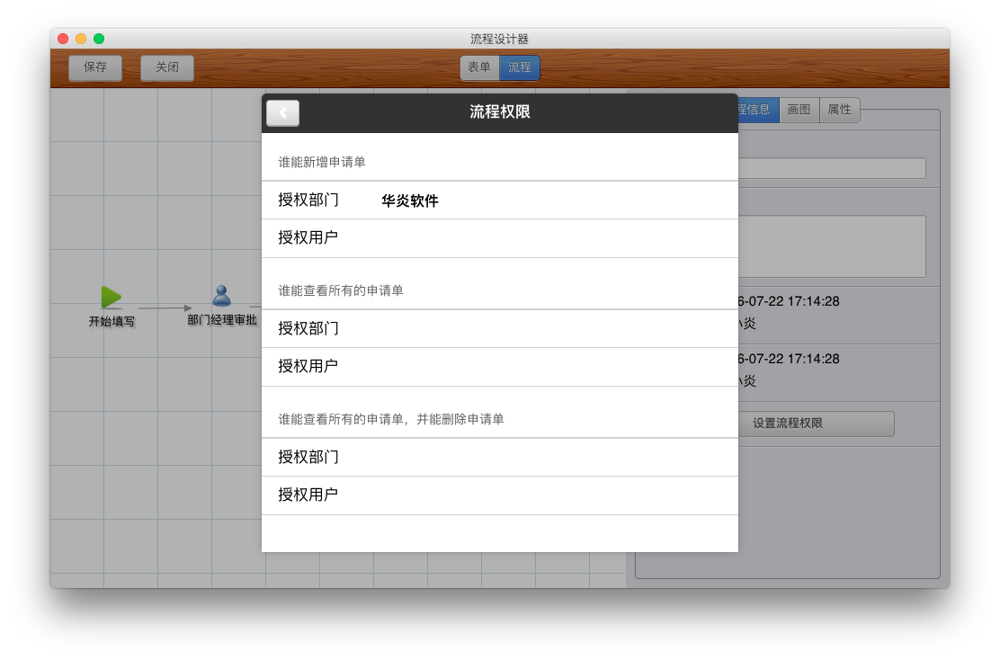

### 权限设置

#### 谁能新增申请单？

您可以设置新建该申请单的权限。可以选择整个公司均有权限、也可以选择某个部门或者某些个人有权限提交本申请。如果没有权限的人员则在新增流程文件时就看不到此流程。

设置的方法有两种：

- 打开流程设计器，在“开始”节点的“属性”中设置可以新建此表单的人员、部门。

  使用审批王时，只要当前用户在这个部门中或是此人员时，就可以提交这个流程申请单。

- 打开流程设计器，点击右侧“流程信息”，点击“设置流程权限”。

  系统显示当前的权限设置情况。如需修改，点击“授权部门”、“授权用户”，勾选相应的部门、用户即可。
  
  

#### 谁能查看所有的申请单？

有些用户，虽然不一定参与申请单的审批过程，如某些业务的分管领导或总经理，但是需要随时查看某些流程的所有申请单。有时，我们将这样的权限称为“监控权限”。

这个需求，可以通过如下设置来实现。

- 打开流程设计器，点击右侧“流程信息”，点击“设置流程权限”。
- 系统显示当前的权限设置情况。如需修改，点击“授权部门”、“授权用户”，勾选相应的部门、用户即可。

#### 谁能删除所有的申请单？

有些用户，虽然不一定参与申请单的审批过程，但是需要随时查看某些流程的所有申请单，并且需要在特定情况下，删除某些申请单。有时，我们将这样的权限称为“管理权限”。

这个需求，可以通过如下设置来实现。

- 打开流程设计器，点击右侧“流程信息”，点击“设置流程权限”。
- 系统显示当前的权限设置情况。如需修改，点击“授权部门”、“授权用户”，勾选相应的部门、用户即可。
