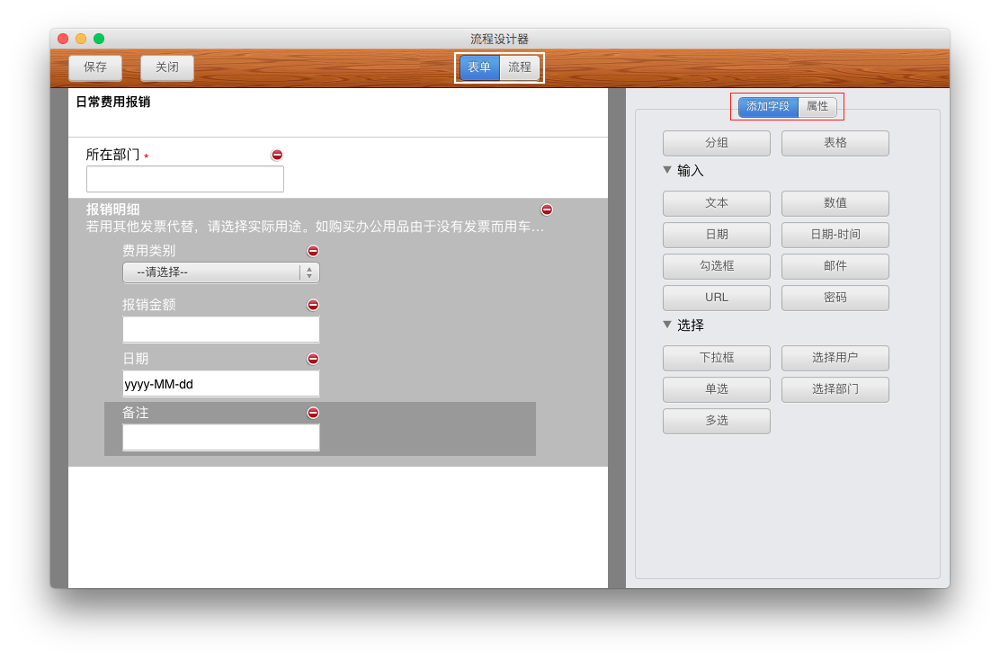

## 表单设计

我们所说的表单就是申请单，用户在提交申请的时候，什么地方可以填，需要填写什么内容，是输入还是选择等等，这些都是管理员在后台设置里面定义的。

设计表单的操作就是对照实际的申请单，从系统中选择相应的字段类型，逐一添加，形成一张电子申请单的样式。不同的字段类型，展现给用户的界面也是不同的。比如下拉框，用户就是从几个选项中选择一个内容；比如数值字段，用户只能输入数字等。字段类型可参照下一节“字段”。

以下以“日常费用报销”单为例，为您演示设计表单的操作步骤。

- 登录华炎云平台之后，首先点击“设置”，点击“流程设计器”。

- 在系统弹出的页面中，点击右上角的“新增流程”按钮。

- 输入流程名称，如“日常费用报销”，点击“好”按钮。

- 系统默认显示的是流程步骤设计页面，在窗口上方选择“表单”。

- 添加字段。报销单的第一个字段是“所在部门”，为录入的文本，所以添加一个“文本”字段。鼠标点中右侧“添加字段”标签下的“文本”，拖动到左侧的合适位置，然后松开鼠标。或者鼠标直接单击右侧“添加字段”标签下的“文本”，这时，左侧会增加一行“文本”字段。

- 鼠标选中左侧的“文本”，再点击右侧的“属性”标签，这时出现的就是“文本”字段的所有属性，可酌情修改。修改“字段名”为“所在部门”，不修改“显示名称”。在“公式”一栏的输入框内，输入“{applicant.organization.fullname}”，这样，在填写该表单时，系统将会自动显示“所在部门”为提交人所在部门。关于公式，可参考[字段公式](form_formula.md)。

- 报销单的第二块是“报销明细”，其下包括数个字段，实际填写报销单时，可以增加不定行数的明细数据。所以，需要添加一个“表格”字段，并将其下字段都置于此“表格”的范围之内。鼠标点中右侧“添加字段”标签下的“表格”，拖动到左侧的合适位置，然后松开鼠标。也可以直接单击右侧“添加字段”标签下的“表格”，这时，左侧会增加一行“表格”字段。

- 鼠标选中左侧的此“表格”，点击右侧的“属性”标签，这时出现的就是“表格”字段的所有属性，可修改：“字段名”为“报销明细”，“描述”内则填上“注：若用其他发票代替，请选择实际用途。如购买办公用品由于没有发票而用车票代替，那么费用类别里应该选择办公用品。”

- 报销明细中的第一个字段是“费用类别”，属于下拉框字段。拖动右侧“下拉框”到左侧的“报销明细”中。

- 在该下拉框属性下，修改字段名，在“输入选项”框内填上可供选择的选项（以回车为分隔），并将该字段设置为必填字段。

- 报销明细中的第二个字段是“报销金额”，属于数值字段，拖动右侧“数值”到左侧的“报销明细”中。

- 在该数值字段属性处，设置字段名、小数点位数，以及“必填”等。

- 继续为表格添加“日期”字段，并在该日期字段的属性处设置字段名为“费用产生日期”，以及设置改字段为必填字段。

- 在表格中继续添加文本字段，并在该字段的属性处设置该字段的字段名为“备注”。

- 报销单中还有一字段“报销金额合计”，为“报销明细”中的“报销金额”的合计值。所以，需要增加一个“数值”字段，并设置其值为“报销金额”的合计值。这时，我们点击表头区域，通过拖动或单击添加一个“数值”字段，设置字段名为“报销金额合计”，在公式输入栏内填入“sum({报销金额})”。这样，在填写该申请单时，输入明细的报销金额，系统会自动计算并将报销金额合计显示在“报销金额合计”处。

- 点击左侧某字段的右上角的“-”即可删除该字段。

- 上下拖动字段，则可以更改字段的上下位置。

- 在界面的左上角有“保存”和“关闭”选项。设计过程中，点击“保存”可随时保存；设计完毕后，点击“关闭”，则保存新表单的内容，并关闭“流程设计器”。

- 回到表单设置界面，将表单的“启用状态”按钮点开，即可开始使用该表单。

