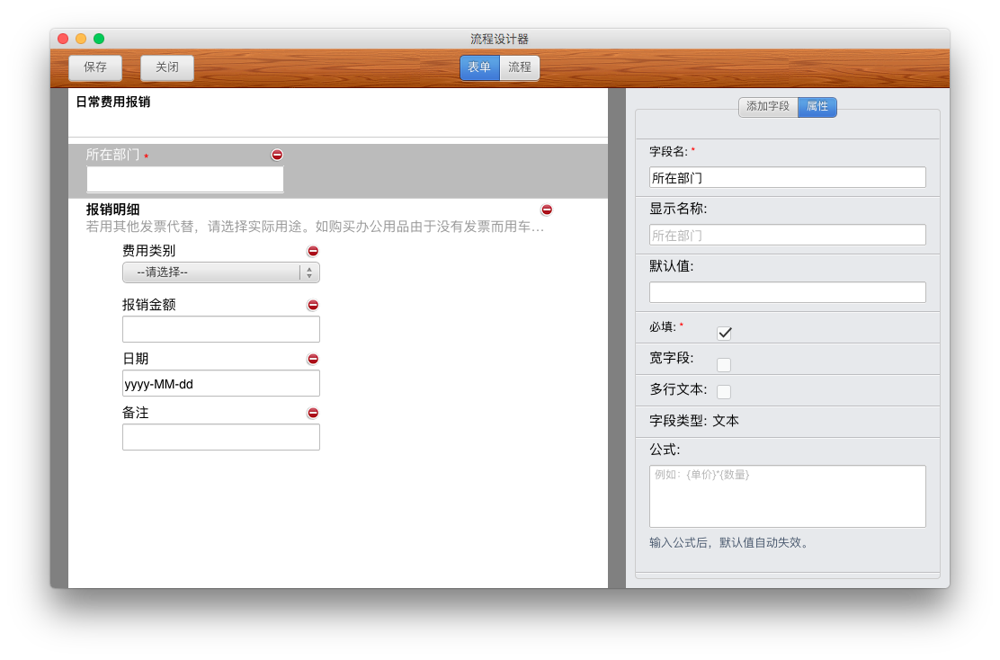

## 字段

为了更便捷的设计申请单，审批王提供了多种类型的字段类型。

申请单中的字段类型包括了三类：输入类字段、选择类字段、以及其他字段。

### 输入类字段

输入类字段指通过输入方式添加内容的字段，包括：

- 文本：适用于输入文本内容的填写框，是最常用的的字段类型，对输入内容没有限制。
- 数值：要求填写的内容必须是数字，适用于金额、合计等，也可用于计算公式的编写。
- 日期：可用于选择年月日的日期，格式为“yy-mm-dd”。
- 日期-时间：在日期的基础上增加了具体的几点几分。
- 勾选框：用于选择是或否。

### 选择类字段

- 下拉框：通过字段属性预置可选择的内容，只可选择一项。
- 选择用户：可在系统已有的用户中选择，名字将会显示在表单中，已邀请的用户无论激活与否都在选择范围内。
- 选择部门：可在系统已有的部门中选择，部门的全路径名字将会显示在表单中。
- 单选：通过字段属性可预置选择项，用户只能选择一项。
- 多选：通过字段属性可预置选择项，用户可选择多项。

### 其他类型字段说明

- 分组：可将说明同一事务的字段进行归类。
- 表格：插入一个表格，可填写明细信息等。

### 字段属性

- 字段名：实际存放在数据库中的名字，此名字在同一张申请单中不可重复。今后公式和条件判断都将使用字段名。
- 显示名称：审批单中实际显示的名字，同一张申请单中可重复，默认的显示名和字段名相同，用户也可自行修改。
- 必填：必填打勾后，提交的申请单不允许为空，画布上以“*”标记。若不打勾，则在提交申请单时候可以为空。
- 宽字段：打勾后，字段显示宽度跨两列，不打勾，字段显示宽度只有一列。
- 列表显示：打勾后，在任何地方，进入高级搜索界面后，选择该字段所在的流程，会在列表显示的时候就会多一列显示此字段的内容。
- 内容可搜：打勾后，在任何申请单的列表界面，根据该字段的内容，搜索都可搜索到相应申请单。
- 默认值：根据需要，预置在字段中的值，可修改。
- 勾选、多选、单选字段属性：输入选项—设置可选项。
- 用户、部门选择字段属性：选择类型—可选一个还是多个。

**注：字段名需唯一，显示名称可以重复。**
