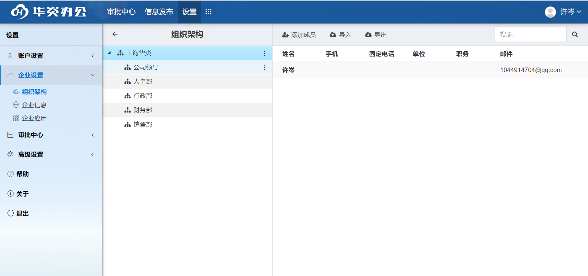
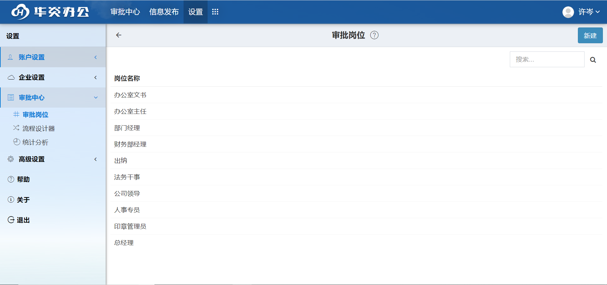
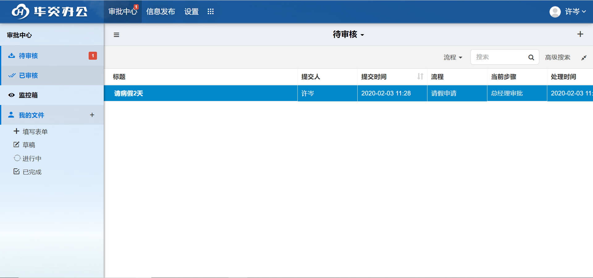

## 如何快速试用审批王
### 注册
- 打开浏览器，进入[审批王](https://www.steedos.com/cn/)
- 点击“注册试用”按钮，或右上角的注册按钮。
- 进入注册界面,输入用户名、邮箱、密码等即可完成注册。
   
	 

### 邀请用户
注册之后登录，默认进去审批中心模块。此时我们需要去设置模块邀请用户。
- 设置->工作区->组织架构，右侧会出现默认的组织架构图。
- 左侧是系统默认为你创建的几个部门，右侧是当前工作区的用户，你可以点击右上方的“+”按钮，邀请用户。
- 在弹出的“邀请用户”框里。输入您要邀请的人的邮箱，每个邮箱以换行结束。
- 确定之后，系统会发送邮件注册链接给这些用户，他们注册之后会默认进去此工作区。(为方便试用，我们先邀请几个已经存在的用户进入工作区，他们的账号密码是123456。)
- 用户添加进入工作区之后，可以直接选择某个用户拖动至指定的部门里。
- 详情见[人员](admin_space_users.html)
   
    

### 配置岗位成员
邀请用户之后，您还需要为每个岗位配置岗位成员。
- 设置->审批中心->岗位。右侧会列出系统默认为您创建的岗位。
- 点击某个岗位，进入岗位编辑界面，为每个岗位配置岗位成员，注意：不同的岗位审批范围不同，有些岗位的审批范围可能是整个工作区，有些则只是某个部门。
- 详情见[岗位及岗位成员](admin_positions.html)
    
    
- 审批范围为全公司的岗位    
    
    
- 审批范围为某个部门的岗位
    
    

### 填写申请单
做完上述准备工作之后，我们来试着拟写一个申请单吧。
- 进入审批中心模块，点击界面上任意一个“+”，弹出拟写窗口，从分类选择要拟写的申请单。详情见[如何填单](instance_add.html)
- 申请单上黄色背景的内容是在当前步骤可以编辑的，填写完之后，选择下一步及下一步处理人之后(如果下一步及下一步处理人唯一，系统会为您默认选择)即可提交。 
     
     

### 审批申请单
- 下一步处理人的登录，在审批中心->待审核列表下可以看到新的待办文件。 详情见[如何审批](instance_approve.html)
- 填写完意见或相应内容之后，提交至下一步。     
     
     