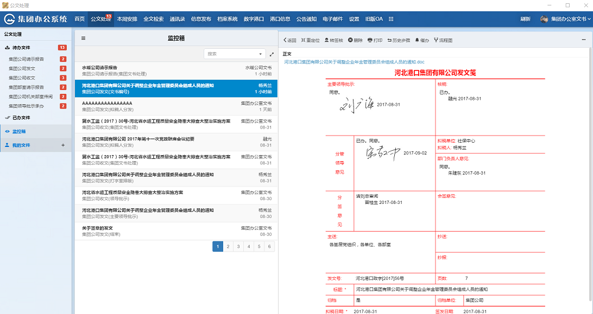


## 专业版功能
申请单在流转过程中需要管理，每个流程都有管理员，负责监控申请单。具体操作如下：

- [重定位](instance_relocate.md)，重定位即跳过当前的步骤，使申请单从流程中任意步骤(非当前步骤)开始流转。
- [转签核](instance_reassign.md)，转签核指同一审批步骤改变审批人员。
- [督办](instance_supervise.md)，系统增加了手机短信催办的功能，对普通、紧急、特急等类型的申请单进行自动提醒、发出催办短信，以提高系统的使用效率。
- [导出](instance_export.md)，为了便于申请单的汇总及统计，可以定期将流转完毕的同一种流程文件按不同的时间范围导出为EXCEL文件。
- [删除](instance_delete.md)，已提交的申请单需流程管理员在监控箱里删除。   
     
     