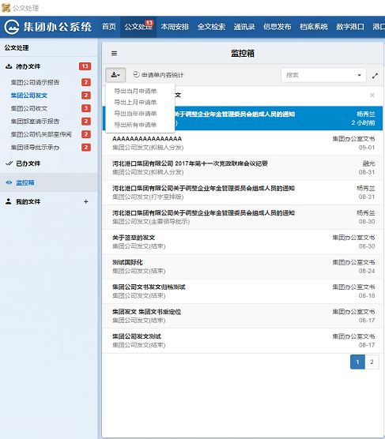


### 导出
为了便于申请单的汇总及统计，流程管理员可以定期将流转完毕的同一种流程文件按不同的时间范围导出为EXCEL文件。

具体操作如下：

- 流程管理员进入“监控箱”，点击漏斗形状的按钮后，选择一个流程，退出高级搜索界面。
- 监控箱文件列表的左上方有一个下载申请单的图标。点击该图标，选择导出当月、上月、当年、或所有的申请单。
- 在弹出的窗口上，选择文件的导出位置，输入导出的文件名，点击确定即可。
- 导出的Excel表格中，包含申请单的每个字段的内容。可以对文件进行排序、统计工作。

     