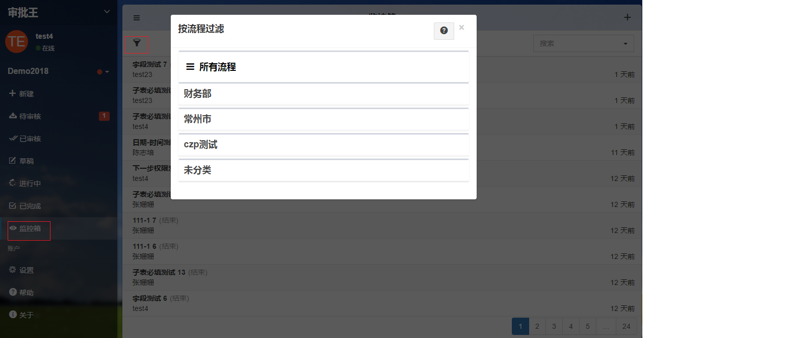

##管理员查询申请单

作为流程管理员和工作区管理员，可以对授权的流程进行监控查看或干预，如中途干预（转签核、重定位）和删除等操作。这些流程的权限是工作区管理员在后台预先设置好的。

- 进入工作区，点击“审批王”，点击“监控箱”。
- 系统将列出所有您有权监控的流程文件。单击左上角的漏斗图标，可以按照流程分类来查看文件。

- 单击任一文件，可以看到该表单的内容及签核历程，展示了这个文件所经历过的步骤、处理人的意见、以及当前的所处的步骤与处理人。

