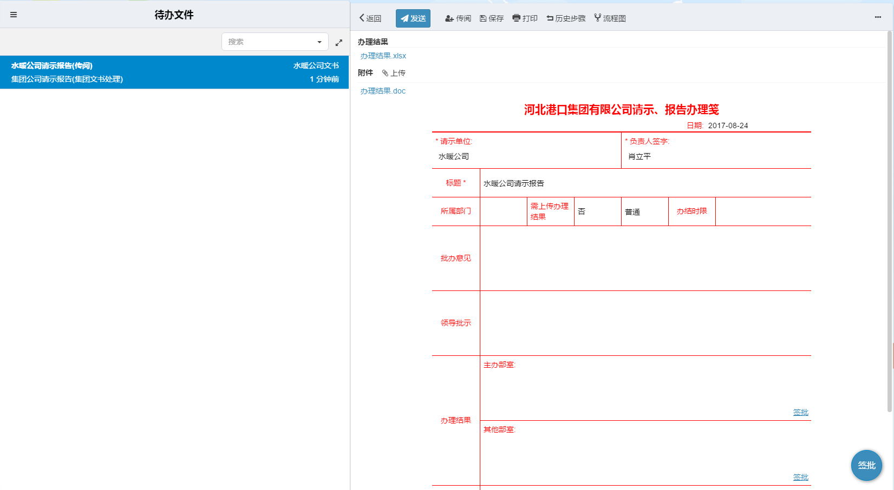
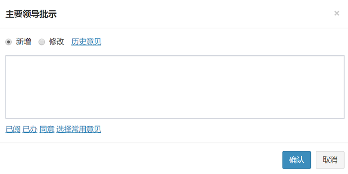


### 意见栏
- 意见栏使用：

   - 在申请单上对应的意见栏的右下角会出现“签批”按钮，点击 “签批”按钮，会弹出一个意见窗口。

       
   - 在弹出的意见窗口中，您可以在意见框中输入意见，也可以直接选择下方我们为您提供的“已阅”、“已办”、“同意”等几个常用意见，您也可以创建自己的常用意见。
   - 若您选择新增，则新的意见不会替换已经存在的意见；若您选择修改，则新的意见会替换掉原来的意见。第一次处理默认是新增意见，之后在处理同一个申请单时，默认为修改。
   
      
- 特殊签批：
   - 一对多：一个步骤的处理人的意见签批在申请单的位置有多个（申请单上有多个签批按钮），但只能而且必须选择选择一个。
   - 多对一：多个处理人或多个步骤的处理人签批在申请单的同一个位置上。
   - 默认已阅：在某些情况下，可以不手动输入，直接发送，系统为您配置“已阅”作为意见。

