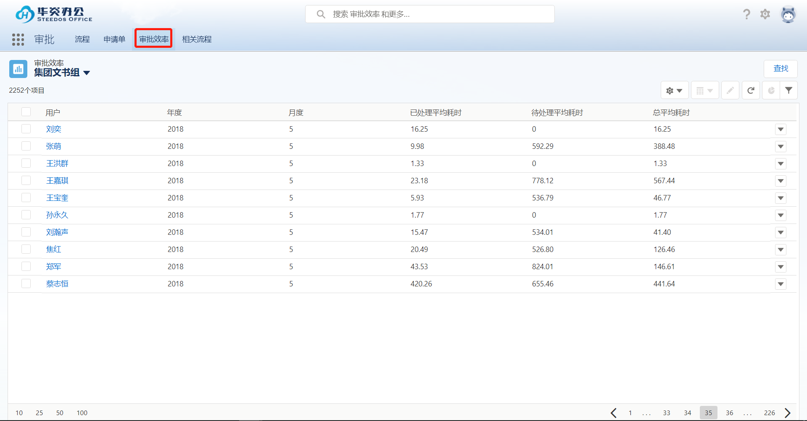
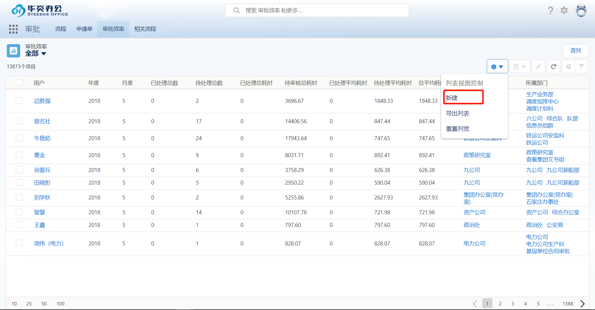
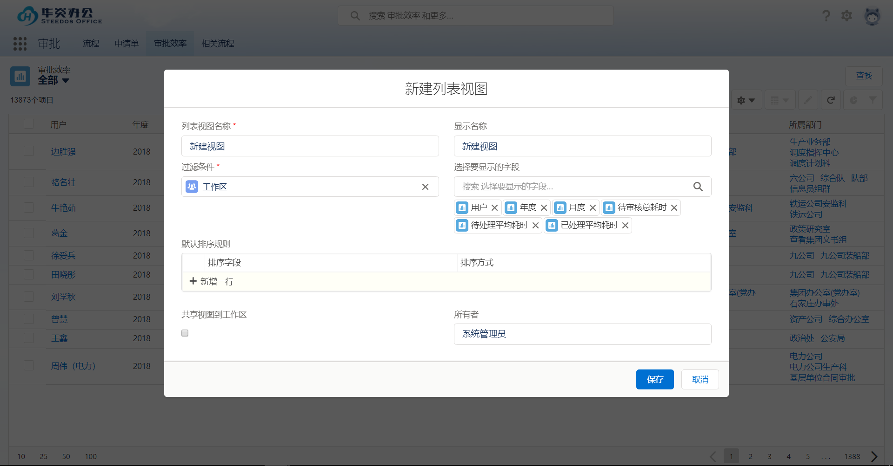
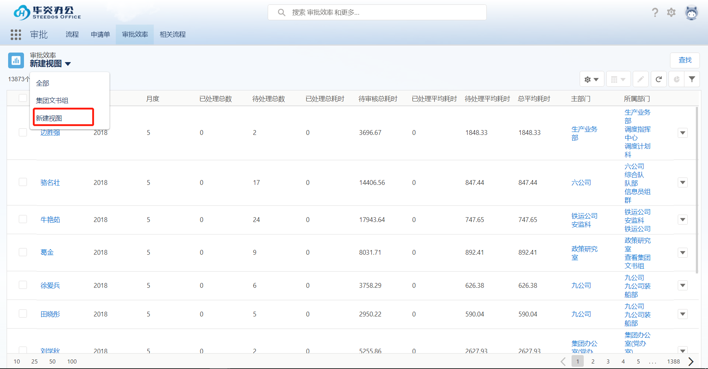
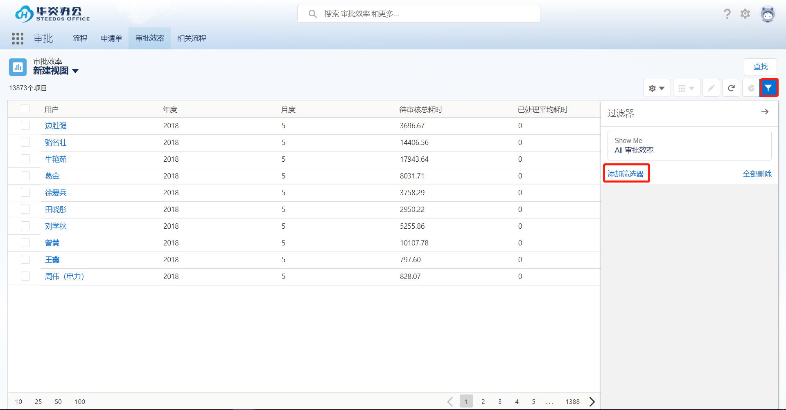
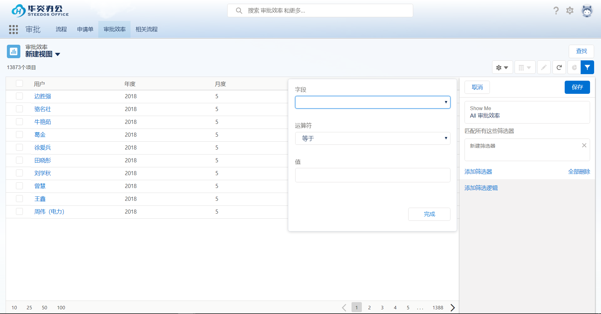
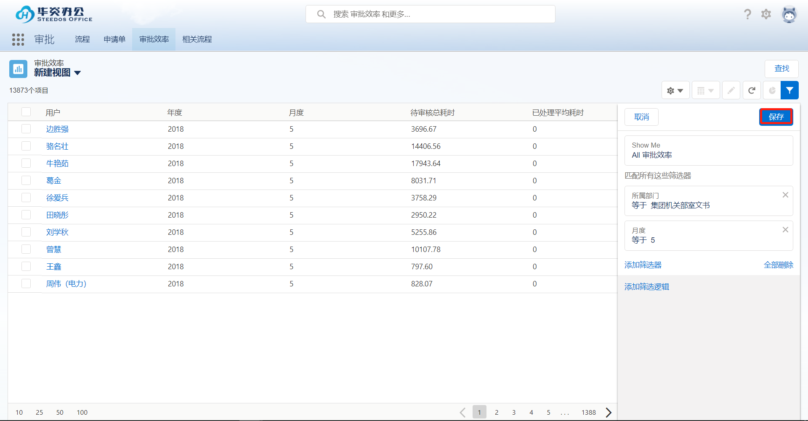
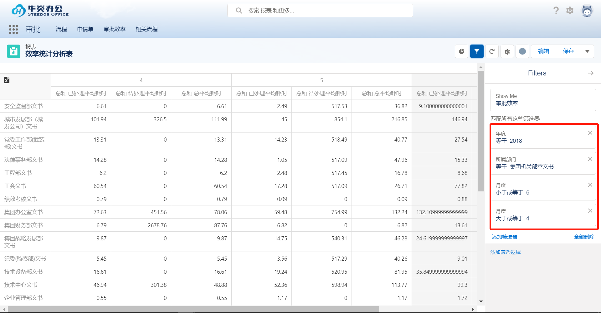
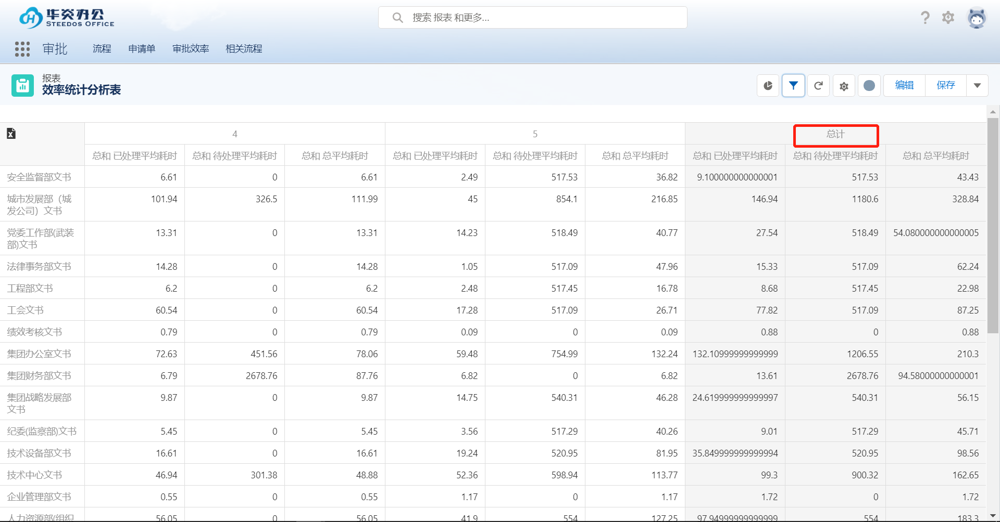
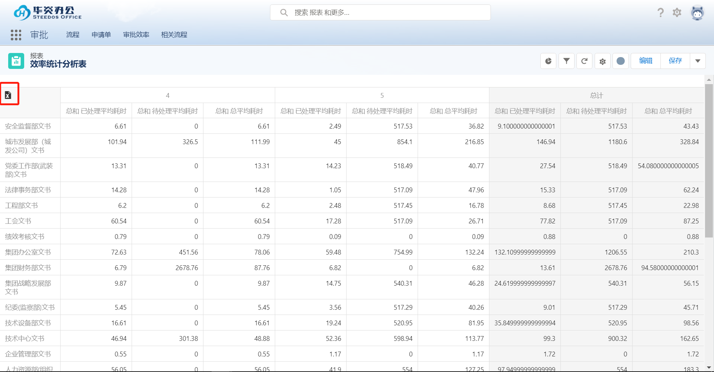

效率审批
===

系统可以根据用户平时处理公文的时间统计出用户处理公文效率，统计出 “已处理平均耗时”“待处理平均耗时”“总平均耗时”等数据，实现文件处理效率、统计分析等功能。
 

目前系统可以在效率统计界面统计出所有用户当前公文处理效率的数据，管理员及用户可以根据自己的实际需求去根据关键信息进行选择过滤。

- 自定义视图

    点击“设置”，选择“新建”，在新建列表视图界面填写视图名称、选择要显示的界面等字段后，保存后即可显示在列表视图界面。
     
     
     

- 条件过滤

    在刚刚新建的视图界面，选择右侧过滤按钮，选择“添加过滤器”。
     

    可以根据系统提供的过滤字段进行过滤，添加过滤条件后，点击保存。即可过滤出所需要的数据。
     
     

- 数据统计

    系统支持统计查看用户近半年，或特定几个月的效率统计功能，自动生成报表。进入报表界面，添加过滤条件，例如查看4、5、6月份统计总和，可以使用 大于等于4月小于等于6月的过滤条件统计出近几个月的数据。
     
     

- 数据导出

    系统支持数据导出功能。点击excel图标，导出数据到本地。
     

